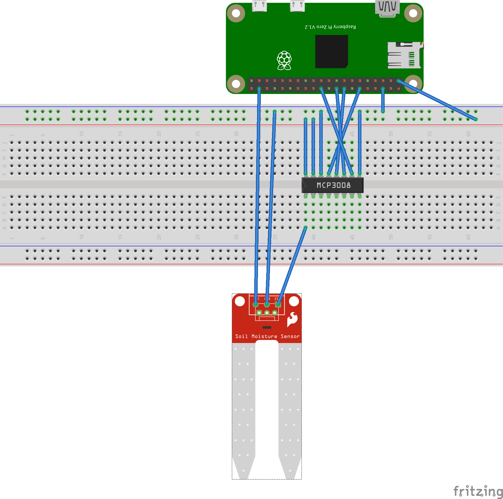

# Soil moisture sensor + Raspberry Pi

> Python script for reading value of an analog soil moisture sensor via an
> MCP3008 and Raspberry Pi

### Breadboard layout



### Script dependencies

```bash
pip install adafruit-mcp3008
```
